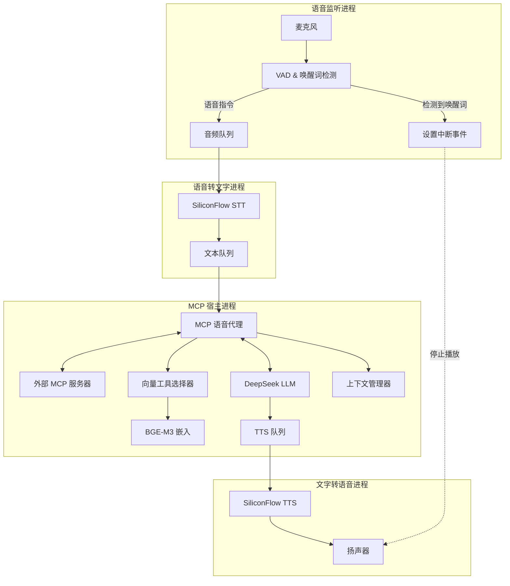

# Hachimi: 基于 MCP 的智能语音助手

[中文说明](README.ZH.md) | [English](README.md)

一个基于 Python 构建的模块化、多进程语音助手。本项目集成了 **模型上下文协议（Model Context Protocol，MCP）**，使大语言模型能够执行工具并与外部系统交互。系统具备实时唤醒词检测、中断能力（插话）、基于向量的智能工具选择、上下文管理与总结功能，并连接高性能云 API 实现语音识别、大语言推理和语音合成。

## 🌟 核心特性

### 智能交互
* **多进程架构**：将关键词检测（KWS）、语音转文字（STT）、LLM 处理和文字转语音（TTS）运行在独立进程中，实现低延迟和非阻塞 I/O
* **MCP 协协议支持**：作为 MCP 客户端，支持连接多个 MCP 服务器（SSE 或 Stdio），自动发现和调用工具
* **插话/中断支持**：用户可在助手说话时随时打断。系统在播放期间检测唤醒词，立即停止 TTS 并聆听新指令

### 智能决策
* **向量工具选择**：使用 BGE-M3 嵌入模型智能选择最相关的工具，大幅提升响应准确性
* **多 MCP 服务器管理**：同时连接和管理多个 MCP 服务器，自动路由工具调用，处理同名工具冲突
* **上下文管理**：支持基于时间和回合数的上下文过期，可选 LLM 智能总结，高效保留对话历史

### 语音处理
* **唤醒词检测**：本地检测使用 `openwakeword`（默认："Hey Jarvis"）
* **语音活动检测（VAD）**：使用 `webrtcvad` 实现精确的语音端点检测
* **云 API 集成**：
  * **LLM**：DeepSeek（通过 OpenAI 兼容 API）
  * **STT**：FunAudioLLM/SenseVoiceSmall（通过 SiliconFlow）
  * **TTS**：FunAudioLLM/CosyVoice（通过 SiliconFlow）支持流式播放
  * **Embeddings**：BAAI/bge-m3（通过 SiliconFlow）用于向量工具选择

## 🏗️ 系统架构

系统使用 Python 的 `multiprocessing` 模块管理四个独立进程，通过队列和事件信号通信。



## 🛠️ 系统要求

### 基础环境
* **Python 3.10+**

### 音频依赖
**PortAudio**：麦克风访问和音频播放必需
* **Ubuntu/Debian**：`sudo apt-get install libasound-dev portaudio19-dev libportaudio2 libportaudiocpp0`
* **macOS**：`brew install portaudio`
* **Windows**：通常通过 pip 处理，可能需要 Visual C++ Build Tools

### API 密钥
* DeepSeek API 密钥（用于 LLM）
* SiliconFlow API 密钥（用于 STT、TTS 和 Embeddings）
* MCP 认证令牌（如果 MCP 服务器需要）

## 📦 安装步骤

1. **克隆仓库**

```bash
git clone https://github.com/cyijun/hachimi
cd hachimi
```

2. **创建虚拟环境（推荐）**

```bash
python -m venv venv
source venv/bin/activate  # Windows: venv\Scripts\activate
```

3. **安装依赖**

```bash
pip install -r requirements.txt
```

## ⚙️ 配置说明

项目使用 `config.yaml` 进行配置，支持环境变量替换（`${VAR_NAME:default_value}`）。

### 1. 设置环境变量

创建 `.env` 文件（从 `.env.example` 复制）或在终端中导出：

```bash
export DEEPSEEK_API_KEY="your_deepseek_key"
export SILICONFLOW_API_KEY="your_siliconflow_key"
export MCP_AUTH_TOKEN="your_mcp_token"  # 如果 MCP 服务器需要
# 可选：export WAKE_WORD_MODEL_PATH="path/to/custom/model.tflite"
```

### 2. 编辑 `config.yaml`

修改配置以自定义模型、URL、音频参数和 MCP 服务器。

**主要配置部分：**

* **`mcp_servers`**：配置一个或多个 MCP 服务器（SSE 或 Stdio）
* **`llm`**：LLM 配置（DeepSeek）
* **`system_prompt`**：自定义助手人设
* **`tool_selection`**：配置向量工具选择（top_k、嵌入设置）
* **`context`**：配置上下文管理（最大回合数、过期时间、总结功能）
* **`voice_listener`**：音频录制和唤醒词设置
* **`stt`** / **`tts`**：语音转文字和文字转语音设置

### 示例配置

```yaml
# MCP 服务器配置（支持多服务器）
mcp_servers:
  smart_home:
    type: "sse"
    url: "http://mininas:8123/mcp_server/sse"
    headers:
      Authorization: "${MCP_AUTH_TOKEN}"

# 工具选择配置
tool_selection:
  top_k: 10 
  use_vector_search: true
  embedding:
    url: "https://api.siliconflow.cn/v1/embeddings"
    model: "BAAI/bge-m3"
    api_key: "${SILICONFLOW_API_KEY}"
    dimensions: 1024

# 上下文管理配置
context:
  max_turns: 10  # 最大保存 10 个回合
  max_time_minutes: 30  # 上下文过期过期 30 分钟
  enable_summarization: true  # 启用 LLM 总结
  summary_role: "user"
  summarization:
    max_summary_tokens: 200
    summary_prompt: "请用中文简洁总结以下对话历史，保留关键信息，总结长度不超过{max_tokens}个token："
```

## 🚀 使用方法

1. **确保 MCP 服务器正在运行**（如果使用工具功能）
2. **启动助手**

```bash
python main.py
```

3. **交互方式**

* 等待日志消息：`🚀 初始化增强版MCP语音代理...` 和 `--- System ready ---`
* 说 **"Hey Jarvis"**
* 等待提示音或日志 `>>> Listening for command`
* 说出您的请求（如："今天天气怎么样？" 或 MCP 工具命令）
* 想在助手说话时打断，直接说 **"Hey Jarvis"** 即可

## 🧪 测试

项目包含基于 Python `unittest` 框架的单元测试：

```bash
# 运行所有测试
python -m unittest discover tests

# 运行特定测试文件
python tests/test/test_config.py          # 配置管理测试
python tests/test/test_logger.py          # 日志系统测试
python tests/test/test_context_summary.py # 上下文管理器测试（7个测试）
```

## 📂 项目结构

```
hachimi/
├── main.py                      # 入口点 - 多进程设置
├── config.yaml                  # 中央配置文件
├── requirements.txt             # Python 依赖
├── .env.example                 # 环境变量模板
├── src/
│   ├── __init__.py
│   ├── config.py               # 配置管理（支持环境变量解析）
│   ├── logger.py               # 统一日志系统
│   ├── voice_listener.py       # KWS、VAD 和音频录制
│   ├── stt.py                  # 语音转文字处理
│   ├── tts.py                  # 文字转语音流式播放
│   └── llm_mcp_host/           # MCP 宿主模块（重构版）
│       ├── __init__.py
│       ├── agent.py            # 主 MCPVoiceAgent 类
│       ├── mcp_manager.py      # 多服务器 MCP 管理器
│       ├── context_manager.py  # 上下文管理（过期 & 总结）
│       ├── vector_tool_selector.py  # 向量工具选择
│       ├── tool_selector.py    # 工具选择器基类
│       ├── prompt_manager.py   # MCP 提示发现与加载
│       └── utils.py            # 工具函数
├── tests/
│   ├── test_config.py          # 配置测试
│   ├── test_logger.py          # 日志测试
│   └── test_context_summary.py # 上下文管理器测试
└── examples/
    └── my_mcp_servers/         # 示例 MCP 服务器实现
```

## 🔧 高级功能

### 向量工具选择

系统使用 BGE-M3 嵌入智能选择最相关的工具：

* **自动选择**：仅向 LLM 呈现 top-k 最相关的工具
* **可配置 Top-K**：通过 `config.yaml` 中的 `tool_selection.top_k` 调整（默认：10）
* **嵌入 API**：使用 SiliconFlow 的 BAAI/bge-m3 模型
* **提升准确性**：减少幻觉，提高工具调用准确性

**工作原理：**
1. 初始化时为所有工具生成嵌入向量
2. 收到用户查询时，获取查询的嵌入向量
3. 计算余弦相似度，找出最相关的 top-k 工具
4. 工具名称匹配会获得额外加分
5. 如嵌入 API 失败，自动回退到基于词频的搜索

### 上下文管理与总结

高级上下文管理，支持自动过期和可选 LLM 总结：

* **基于回合数过期**：仅保留最近的 N 个回合（通过 `context.max_turns` 配置）
* **基于时间过期**：N 分钟后自动过期旧消息
* **LLM 智能总结**：可选总结旧对话回合以保留关键信息
* **可配置总结**：自定义总结提示词、token 限制和角色（user/system）

**配置示例：**

```yaml
context:
  max_turns: 10                    # 保留最近 10 个回合
  max_time_minutes: 30             # 30 分钟后过期
  enable_summarization: true      # 启用 LLM 总结
  summary_role: "user"             # 总结消息角色
  summarization:
    max_summary_tokens: 200        # 总结最大 token 数
    summary_prompt: "请用中文简洁总结以下对话历史..."
```

**总结策略：**
1. 超出回合数限制的消息会被触发总结
2. LLM 生成简洁总结，保留关键信息
3. 总结消息作为一条新消息插入到上下文中
4. 如果 LLM 总结失败，使用简单的文本合并作为回退方案

### 多 MCP 服务器

同时连接多个 MCP 服务器：

```yaml
mcp_servers:
  smart_home:
    type: "sse"
    url: "http://mininas:8123/mcp_server/sse"
    headers:
      Authorization: "${MCP_AUTH_TOKEN}"

  weather_service:
    type: "stdio"
    command: "python"
    args: ["-m", "weather_mcp"]
```

**功能特性：**
* 从所有服务器自动发现工具
* 自动将工具调用路由到正确的服务器
* 处理同名工具的冲突
* 故障隔离 - 单个服务器故障不影响其他服务器

## 📊 性能监控

MCP 代理提供详细的性能统计信息：

* 总对话回合数
* 总工具调用次数
* 错误统计
* 上下文使用情况
* 工具选择效果
* MCP 服务器连接状态

统计信息每 N 轮记录一次（通过 `advanced.monitoring.stats_interval_turns` 配置）。

## 🐛 故障排除

| 问题 | 解决方案 |
|------|----------|
| **ALSA/PortAudio 错误** | Linux 上常见警告通常无害。如果音频失败，确保麦克风和扬声器是默认系统设备 |
| **唤醒词灵敏度** | 调整 `config.yaml` 中的 `voice_listener.wake_word_threshold`（太高检测不到，太低误触发） |
| **MCP 连接被拒绝** | 确保 `config.yaml` 中的 URL 与 MCP 服务器地址匹配，服务器正在运行 |
| **嵌入 API 错误** | 验证 SiliconFlow API 密钥设置正确且有足够配额 |
| **上下文总结问题** | 如果总结失败，确保 LLM 有足够的上下文窗口处理对话和总结 |

## 📝 开发指南

参见 [AGENTS.md](AGENTS.md) 了解详细的开发指南，包括：

* 构建、测试和 Lint 命令
* 代码风格和约定
* 架构说明（多进程、async/await、MCP 集成）
* 开发实践和模式

### 代码风格

* **导入顺序**：标准库 → 第三方库 → 本地模块（部分文件采用逻辑分组）
* **类型提示**：函数签名和类方法使用一致类型提示
* **命名约定**：
  * 类：`PascalCase`（如 `Config`、`MCPVoiceAgent`）
  * 函数/方法：`snake_case`（如 `process_tts`、`get_all_tools`）
  * 变量：`snake_case`（如 `audio_queue`、`tts_text`）
  * 私有成员：`_prefix`（如 `_config`、`_load_config`）
* **错误处理**：适当使用 try-except 块
* **日志**：使用 `logger.py` 中的全局 `logger`

### 运行项目

```bash
python main.py
```

## 🤝 贡献指南

欢迎贡献！请确保：

1. 代码遵循项目风格指南（参见 AGENTS.md）
2. 新功能在适当位置包含测试
3. 文档更新反映用户可见的变化
4. 提交信息清晰简洁

## 📄 许可证

参见 LICENSE 文件了解详情。

---

**注意**：本项目专为智能家居自动化和语音控制场景设计。针对多进程环境中的低延迟响应和高效资源使用进行了优化。
