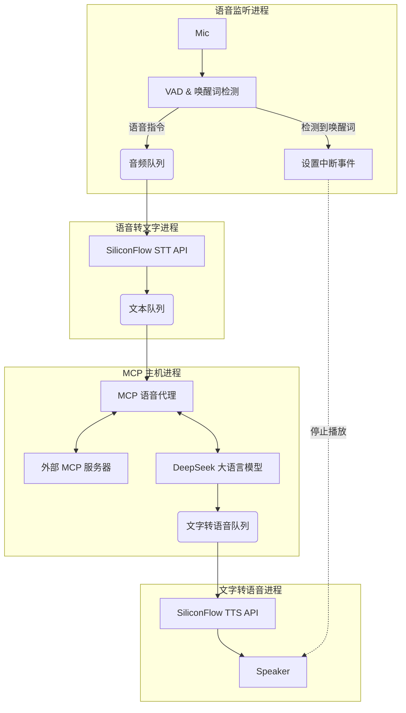

# Hachimi：基于 MCP 的语音助手

[中文说明](README.ZH.md) | [English](README.md)

一个使用 Python 构建的模块化、多进程语音助手。本项目集成了**模型上下文协议（Model Context Protocol, MCP）**，使得大语言模型能够执行工具并与外部系统交互。它具备实时唤醒词检测、中断能力（即“抢说”），并连接高性能云 API 提供语音转文字、大语言模型处理和文字转语音功能。

## 🌟 核心特性

* **多进程架构**：唤醒词检测、语音转文字、大语言模型处理和文字转语音分别在独立进程中运行，实现低延迟和非阻塞I/O。
* **模型上下文协议（MCP）主机**：作为 MCP 客户端，允许大语言模型发现并调用已连接的 MCP 服务器（SSE 或 Stdio）中的工具。
* **支持“抢说”/中断**：用户可以在助手说话时打断它。系统在播放音频时检测到唤醒词，会立即停止文字转语音，开始监听新指令。
* **唤醒词检测**：使用 `openwakeword` 进行本地检测（默认唤醒词："Hey Jarvis"）。
* **语音活动检测**：使用 `webrtcvad` 进行精确的语音端点检测。
* **云 API 集成**：
  * **大语言模型**：DeepSeek（通过兼容 OpenAI 的 API）。
  * **语音转文字**：FunAudioLLM/SenseVoiceSmall（通过 SiliconFlow）。
  * **文字转语音**：FunAudioLLM/CosyVoice2（通过 SiliconFlow），支持流式播放。

## 🏗️ 系统架构

系统利用 Python 的 `multiprocessing` 模块管理四个独立的进程，通过队列和事件信号进行通信。



## 🛠️ 环境要求

* **Python 3.10+**
* **PortAudio**：访问麦克风和播放音频所必需。
  * *Ubuntu/Debian*: `sudo apt-get install libasound-dev portaudio19-dev libportaudio2 libportaudiocpp0`
  * *macOS*: `brew install portaudio`
  * *Windows*: 通常通过 pip 安装即可，但可能需要 Visual C++ 构建工具。
* **API 密钥**：
  * DeepSeek API 密钥。
  * SiliconFlow API 密钥（用于语音转文字和文字转语音）。

## 📦 安装步骤

1. **克隆仓库：**

```bash
git clone https://github.com/cyijun/hachimi
cd hachimi
```

1. **创建虚拟环境（推荐）：**

```bash
python -m venv venv
source venv/bin/activate  # Windows 系统: venv\Scripts\activate
```

1. **安装依赖：**

```bash
pip install -r requirements.txt
```

## ⚙️ 配置

项目使用 `config.yaml` 文件进行配置，并支持环境变量替换（`${VAR_NAME}`）。

1. **设置环境变量：**
    创建一个 `.env` 文件或在终端中导出以下变量：

```bash
export DEEPSEEK_API_KEY="你的_deepseek_密钥"
export SILICONFLOW_API_KEY="你的_siliconflow_密钥"
export MCP_AUTH_TOKEN="你的_mcp_令牌" # 如果你的 MCP 服务器需要的话
# 可选
# export WAKE_WORD_MODEL_PATH="路径/到/你的/自定义模型.tflite"
```

1. **编辑 `config.yaml`（可选）：**
    你可以修改 `config.yaml` 来更改模型、URL 或音频参数。
    * **MCP 服务器**：更新 `mcp_server.url` 以指向你运行的 MCP 服务器（默认是 `http://hw-b520:8123/mcp_server/sse`）。
    * **系统提示词**：自定义 `system_prompt` 来改变助手的行为风格。

## 🚀 使用方法

1. **确保你的 MCP 服务器正在运行**（如果使用工具的话）。
2. **运行助手：**

```bash
python main.py
```

1. **交互：**

* 等待日志消息：`--- 系统准备就绪 ---`。
* 说出 **"Hey Jarvis"**。
* 等待“滴”声或日志 `>>> 正在监听指令`。
* 说出你的请求（例如，“天气怎么样？”或给你的 MCP 工具的指令）。
* 要在助手说话时停止它，只需再次说出 **"Hey Jarvis"**。

## 📂 项目结构

* **`main.py`**：程序入口。设置多进程队列、事件，并启动 4 个核心进程。
* **`voice_listener.py`**：处理麦克风输入、语音活动检测和唤醒词检测（`openwakeword`）。包含录制和截取音频片段的逻辑。
* **`stt.py`**：监控音频队列。将音频发送到云语音转文字 API，并将识别出的文本推送到文本队列。
* **`llm_mcp_host.py`**：核心智能模块。
  * 初始化 `MCPVoiceAgent`。
  * 连接到 MCP 服务器。
  * 管理与大语言模型的对话历史和工具执行循环。
* **`tts.py`**：监控文字转语音队列。从云文字转语音 API 流式传输音频到扬声器。处理即时中断逻辑。
* **`config.py`** & **`config.yaml`**：集中式配置管理，支持解析环境变量。
* **`logger.py`**：统一的日志配置。

## 🐛 故障排除

* **ALSA/PortAudio 错误**：在 Linux 上可能会看到许多来自 ALSA 的警告，这些通常无害。如果音频失败，请确保你的麦克风和扬声器是系统的默认音频设备。
* **唤醒词敏感度**：如果唤醒词触发太频繁或太不敏感，请在 `config.yaml` 中调整 `wake_word_threshold` 的值。
* **MCP 连接被拒绝**：确保 `config.yaml` 中的 URL 与你的 MCP 服务器地址匹配，并且服务器处于活动状态。
