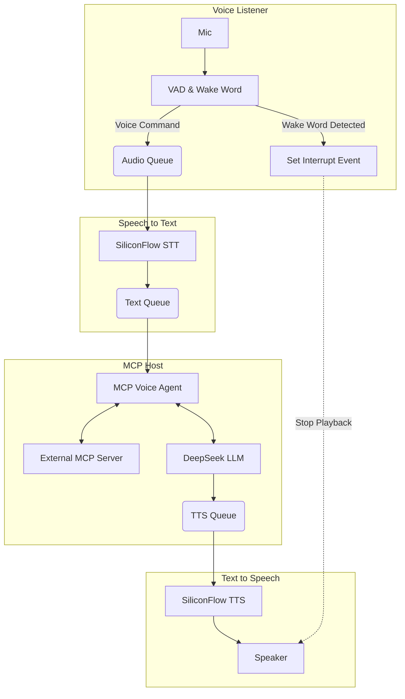

# Hachimi: MCP-Powered Voice Assistant

[中文说明](README.ZH.md) | [English](README.md)

A modular, multiprocessing voice assistant built with Python. This project integrates the **Model Context Protocol (MCP)** to allow the LLM to execute tools and interact with external systems. It features real-time wake word detection, interrupt capabilities (barge-in), and connects to high-performance cloud APIs for STT, LLM, and TTS.

## 🌟 Key Features

* **Multiprocessing Architecture**: Runs Keyword Spotting (KWS), Speech-to-Text (STT), LLM processing, and Text-to-Speech (TTS) in separate processes for low latency and non-blocking I/O.
* **Model Context Protocol (MCP) Host**: Acts as an MCP Client, allowing the LLM to discover and call tools from a connected MCP Server (SSE or Stdio).
* **Barge-in / Interrupt Support**: Users can interrupt the assistant while it is speaking. The system detects the wake word during playback and immediately stops TTS to listen to the new command.
* **Wake Word Detection**: Local detection using `openwakeword` (default: "Hey Jarvis").
* **Voice Activity Detection (VAD)**: Uses `webrtcvad` for precise speech endpointing.
* **Cloud API Integration**:
  * **LLM**: DeepSeek (via OpenAI compatible API).
  * **STT**: FunAudioLLM/SenseVoiceSmall (via SiliconFlow).
  * **TTS**: FunAudioLLM/CosyVoice2 (via SiliconFlow) with streaming playback.

## 🏗️ Architecture

The system utilizes Python's `multiprocessing` module to manage four distinct processes connected via Queues and Event signals.



## 🛠️ Prerequisites

* **Python 3.10+**
* **PortAudio**: Required for microphone access and audio playback.
* *Ubuntu/Debian*: `sudo apt-get install libasound-dev portaudio19-dev libportaudio2 libportaudiocpp0`
* *macOS*: `brew install portaudio`
* *Windows*: Usually handled via pip, but you may need Visual C++ Build Tools.

* **API Keys**:
* DeepSeek API Key.
* SiliconFlow API Key (for STT/TTS).

## 📦 Installation

1. **Clone the repository:**

```bash
git clone https://github.com/cyijun/hachimi
cd hachimi
```

1. **Create a virtual environment (recommended):**

```bash
python -m venv venv
source venv/bin/activate  # On Windows: venv\Scripts\activate
```

1. **Install dependencies:**

```bash
pip install -r requirements.txt
```

## ⚙️ Configuration

The project uses `config.yaml` for settings and supports environment variable substitution (`${VAR_NAME}`).

1. **Set Environment Variables:**
Create a `.env` file or export these variables in your terminal:

```bash
export DEEPSEEK_API_KEY="your_deepseek_key"
export SILICONFLOW_API_KEY="your_siliconflow_key"
export MCP_AUTH_TOKEN="your_mcp_token" # If required by your MCP server
# Optional
# export WAKE_WORD_MODEL_PATH="path/to/custom/model.tflite"
```

1. **Edit `config.yaml` (Optional):**
You can modify `config.yaml` to change models, URLs, or audio parameters.

* **MCP Server**: Update `mcp_server.url` to point to your running MCP server (default is `http://hw-b520:8123/mcp_server/sse`).
* **System Prompt**: Customize the `system_prompt` to change the assistant's personality.

## 🚀 Usage

1. **Ensure your MCP Server is running** (if using tools).
2. **Run the Assistant:**

```bash
python main.py
```

1. **Interact:**

* Wait for the log message: `--- System ready ---`.
* Say **"Hey Jarvis"**.
* Wait for the beep or log `>>> Listening for command`.
* Speak your request (e.g., "What is the weather like?" or a command for your MCP tools).
* To stop the assistant while it is speaking, just say **"Hey Jarvis"** again.

## 📂 Project Structure

* **`main.py`**: Entry point. Sets up multiprocessing queues, events, and starts the 4 core processes.
* **`voice_listener.py`**: Handles microphone input, VAD (Voice Activity Detection), and Wake Word detection (`openwakeword`). Logic for recording and cutting audio clips.
* **`stt.py`**: Monitors the Audio Queue. Sends audio to the Cloud STT API and pushes text to the Text Queue.
* **`llm_mcp_host.py`**: The core intelligence.
* Initializes the `MCPVoiceAgent`.
* Connects to the MCP Server.
* Manages the chat history and tool execution loop with the LLM.

* **`tts.py`**: Monitors the TTS Queue. Streams audio from the Cloud TTS API to the speaker. Handles immediate interruption logic.
* **`config.py`** & **`config.yaml`**: centralized configuration management with environment variable parsing.
* **`logger.py`**: Unified logging configuration.

## 🐛 Troubleshooting

* **ALSA/PortAudio Errors**: You may see many warnings from ALSA on Linux. These are usually harmless. If audio fails, ensure your microphone and speakers are the default system devices.
* **Wake Word Sensitivity**: Adjust `wake_word_threshold` in `config.yaml` if it triggers too often or too rarely.
* **MCP Connection Refused**: Ensure the URL in `config.yaml` matches your MCP server's address and that the server is active.
