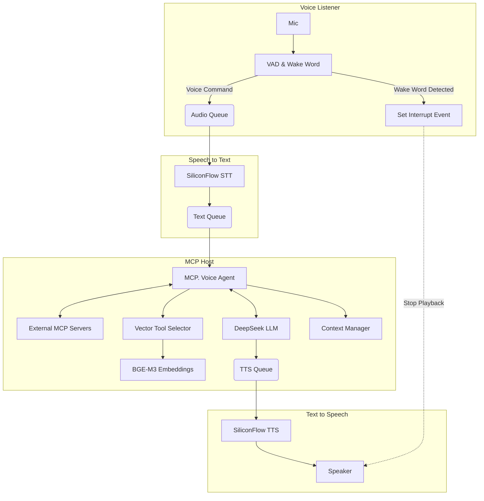

# Hachimi: MCP-Powered Voice Assistant

[中文说明](README.ZH.md) | [English](README.md)

A modular, multiprocessing voice assistant built with Python. This project integrates the **Model Context Protocol (MCP)** to allow the LLM to execute tools and interact with external systems. It features real-time wake word detection, interrupt capabilities (barge-in), vector-based tool selection, context management with summarization, and connects to high-performance cloud APIs for STT, LLM, and TTS.

## 🌟 Key Features

### Intelligent Interaction
* **Multiprocessing Architecture**: Runs Keyword Spotting (KWS), Speech-to-Text (STT), LLM processing, and Text-to-Speech (TTS) in separate processes for low latency and non-blocking I/O.
* **Model Context Protocol (MCP) Host**: Acts as an MCP Client, supporting multiple MCP servers (SSE or Stdio) for tool discovery and execution.
* **Barge-in / Interrupt Support**: Users can interrupt the assistant while it's speaking. The system detects the wake word during playback and immediately stops TTS to listen to the new command.

### Intelligent Decision Making
* **Vector-based Tool Selection**: Uses BGE-M3 embeddings to intelligently select the most relevant tools for each query, significantly improving response accuracy.
* **Multiple MCP Servers**: Simultaneously connect and manage multiple MCP servers with automatic tool routing and conflict resolution.
* **Context Management**: Advanced context management with time-based and turn-based expiration, plus optional LLM-based summarization for efficient conversation history preservation.

### Speech Processing
* **Wake Word Detection**: Local detection using `openwakeword` (default: "Hey Jarvis").
* **Voice Activity Detection (VAD)**: Uses `webrtcvad` for precise speech endpointing.
* **Cloud API Integration**:
  * **LLM**: DeepSeek (via OpenAI compatible API).
  * **STT**: FunAudioLLM/SenseVoiceSmall (via SiliconFlow).
  * **TTS**: FunAudioLLM/CosyVoice (via SiliconFlow) with streaming playback.
  * **Embeddings**: BAAI/bge-m3 (via SiliconFlow) for vector-based tool selection.

## 🏗️ Architecture

The system utilizes Python's `multiprocessing` module to manage four distinct processes connected via Queues and Event signals.



## 🛠️ Prerequisites

### System Requirements
* **Python 3.10+**

### Audio Dependencies
**PortAudio**: Required for microphone access and audio playback.
* **Ubuntu/Debian**: `sudo apt-get install libasound-dev portaudio19-dev libportaudio2 libportaudiocpp0`
* **macOS**: `brew install portaudio`
* **Windows**: Usually handled via pip, but you may need Visual C++ Build Tools.

### API Keys
* DeepSeek API Key (for LLM)
* SiliconFlow API Key (for STT, TTS, and Embeddings)
* MCP Auth Token (if required by your MCP server)

## 📦 Installation

1. **Clone the repository:**

```bash
git clone https://github.com/cyijun/hachimi
cd hachimi
```

2. **Create a virtual environment (recommended):**

```bash
python -m venv venv
source venv/bin/activate  # On Windows: venv\Scripts\activate
```

3. **Install dependencies:**

```bash
pip install -r requirements.txt
```

## ⚙️ Configuration

The project uses `config.yaml` for settings and supports environment variable substitution (`${VAR_NAME:default_value}`).

### 1. Set Environment Variables
Create a `.env` file (copy from `.env.example`) or export these variables in your terminal:

```bash
export DEEPSEEK_API_KEY="your_deepseek_key"
export SILICONFLOW_API_KEY="your_siliconflow_key"
export MCP_AUTH_TOKEN="your_mcp_token"  # If required by your MCP server
# Optional: export WAKE_WORD_MODEL_PATH="path/to/custom/model.tflite"
```

### 2. Edit `config.yaml`
Modify `config.yaml` to customize models, URLs, audio parameters, and MCP servers.

**Key Configuration Sections:**

* **`mcp_servers`**: Configure one or more MCP servers (SSE or Stdio)
* **`llm`**: LLM configuration (DeepSeek)
* **`system_prompt`**: Customize the assistant's personality
* **`tool_selection`**: Configure vector-based tool selection (top_k, embedding settings)
* **`context`**: Configure context management (max turns, expiration, summarization)
* **`voice_listener`**: Audio recording and wake word settings
* **`stt`** / **`tts`**: Speech-to-Text and Text-to-Speech settings

### Example Configuration

```yaml
# MCP servers configuration (supports multiple servers)
mcp_servers:
  smart_home:
    type: "sse"
    url: "http://mininas:8123/mcp_server/sse"
    headers:
      Authorization: "${MCP_AUTH_TOKEN}"

# Tool selection configuration
tool_selection:
  top_k: 10 
  use_vector_search: true
  embedding:
    url: "https://api.siliconflow.cn/v1/embeddings"
    model: "BAAI/bge-m3"
    api_key: "${SILICONFLOW_API_KEY}"
    dimensions: 1024

# Context management configuration
context:
  max_turns: 10  # Keep last 10 turns
  max_time_minutes: 30  # Context expires after 30 minutes
  enable_summarization: true  # Enable LLM summarization
  summary_role: "user"
  summarization:
    max_summary_tokens: 200
    summary_prompt: "Please summarize the following conversation history in Chinese, keeping key information, summary length not exceeding {max_tokens} tokens:"
```

## 🚀 Usage

1. **Ensure your MCP Server(s) are running** (if using tools).
2. **Run the Assistant:**

```bash
python main.py
```

3. **Interact:**

* Wait for the log message: `🚀 初始化增强版MCP语音代理...` followed by `--- System ready ---`.
* Say **"Hey Jarvis"**.
* Wait for the beep or log `>>> Listening for command`.
* Speak your request (e.g., "What is the weather like?"?" or a command for your MCP tools).
* To stop the assistant while it's speaking, just say **"Hey Jarvis"** again.

## 🧪 Testing

The project includes unit tests using Python's `unittest` framework:

```bash
# Run all tests
python -m unittest discover tests

# Run specific test file
python tests/test_config.py          # Configuration management tests
python tests/test_logger.py          # Logging system tests
python tests/test_context_summary.py # Context manager tests (7 tests)
```

## 📂 Project Structure

```
hachimi/
├── main.py                      # Entry point - multiprocessing setup
├── config.yaml                  # Central configuration file
├── requirements.txt             # Python dependencies
├── .env.example                 # Environment variable template
├── src/
│   ├── __init__.py
│   ├── config.py               # Configuration management with env var parsing
│   ├── logger.py               # Unified logging system
│   ├── voice_listener.py       # KWS, VAD, and audio recording
│   ├── stt.py                  # Speech-to-Text processing
│   ├── tts.py                  # Text-to-Speech streaming
│   └── llm_mcp_host/           # MCP host module (refactored)
│       ├── __init__.py
│       ├── agent.py            # Main MCPVoiceAgent class
│       ├── mcp_manager.py      # Multi-server MCP manager
│       ├── context_manager.py  # Context with expiration & summarization
│       ├── vector_tool_selector.py  # Vector-based tool selection
│       ├── tool_selector.py    # Base tool selector interface
│       ├── prompt_manager.py   # MCP prompt discovery & loading
│       └── utils.py            # Utility functions
├── tests/
│   ├── test_config.py          # Configuration tests
│   ├── test_logger.py          # Logger tests
│   └── test_context_summary.py # Context manager tests
└── examples/
    └── my_mcp_servers/         # Example MCP server implementations
```

## 🔧 Advanced Features

### Vector-based Tool Selection

The system uses BGE-M3 embeddings to intelligently select the most relevant tools for each query:

* **Automatic Selection**: Only presents the top-k most relevant tools to the LLM
* **Configurable Top-K**: Adjust via `tool_selection.top_k` in `config.yaml` (default: 10)
* **Embedding API**: Uses SiliconFlow's BAAI/bge-m3 model
* **Improved Accuracy**: Reduces hallucinations and improves tool call accuracy

**How it works:**
1. Generates embedding vectors for all tools during initialization
2. Gets embedding vector for user query when received
3. Calculates cosine similarity to find top-k most relevant tools
4. Tool name matching gets bonus points
5. Falls back to frequency-based search if embedding API fails

### Context Management with Summarization

Advanced context management with automatic expiration and optional LLM summarization:

* **Turn-based Expiration**: Keep only recent N turns (configurable via `context.max_turns`)
* **Time-based Expiration**: Automatically expire old messages after N minutes
* **LLM Summarization**: Optionally summarize old conversation turns to preserve key information
* **Configurable Summary**: Custom summary prompts, token limits, and role (user/system)

**Configuration example:**

```yaml
context:
  max_turns: 10                    # Keep last 10 turns
  max_time_minutes: 30             # Expire after 30 minutes
  enable_summarization: true       # Enable LLM summarization
  summary_role: "user"             # Summary message role
  summarization:
    max_summary_tokens: 200        # Max tokens for summary
    summary_prompt: "Please summarize the following conversation history in Chinese..."
```

**Summarization strategy:**
1. Messages exceeding turn limit trigger summarization
2. LLM generates concise summary preserving key information
3. Summary message inserted as a new message in context
4. Simple text merger used as fallback if LLM summarization fails

### Multiple MCP Servers

Connect to multiple MCP servers simultaneously:

```yaml
mcp_servers:
  smart_home:
    type: "sse"
    url: "http://mininas:8123/mcp_server/sse"
    headers:
      Authorization: "${MCP_AUTH_TOKEN}"

  weather_service:
    type: "stdio"
    command: "python"
    args: ["-m", "weather_mcp"]
```

**Features:**
* Automatic tool discovery from all servers
* Automatic tool call routing to correct server
* Conflict resolution for tools with same name
* Fault isolation - single server failure doesn't affect others

## 📊 Performance Monitoring

The MCP agent provides detailed performance statistics:

* Total conversation turns
* Total tool calls
* Error statistics
* Context usage information
* Tool selection effectiveness
* MCP server connection status

Statistics are logged every N turns (configurable via `advanced.monitoring.stats_interval_turns`).

## 🐛 Troubleshooting

| Issue | Solution |
|-------|----------|
| **ALSA/PortAudio Errors** | Common warnings on Linux are usually harmless. If audio fails, ensure your microphone and speakers are default system devices. |
| **Wake Word Sensitivity** | Adjust `voice_listener.wake_word_threshold` in `config.yaml` (too high = not detected, too low = false triggers). |
| **MCP Connection Refused** | Ensure URL in `config.yaml` matches your MCP server address and server is running. |
| **Embedding API Errors** | Verify SiliconFlow API key is set correctly and has sufficient quota. |
| **Context Summarization Issues** | If summarization fails, ensure LLM has sufficient context window to handle both conversation and summary. |

## 📝 Development Guidelines

See [**AGENTS.md**](AGENTS.md) for detailed development guidelines, including:

* Build, test, and lint commands
* Code style and conventions
* Architecture notes (multiprocessing, async/await, MCP integration)
* Development practices and patterns

### Code Style

* **Import Order**: Standard library → third-party → local modules (some files use logical grouping)
* **Type Hints**: Consistent type hints on function signatures and class methods
* **Naming Conventions**:
  * Classes: `PascalCase` (e.g., `Config`, `MCPVoiceAgent`)
  * Functions/Methods: `snake_case` (e.g., `process_tts`, `get_all_tools`)
  * Variables: `snake_case` (e.g., `audio_queue`, `tts_text`)
  * Private members: `_prefix` (e.g., `_config`, `_load_config`)
* **Error Handling**: Try-except blocks with appropriate exception handling
* **Logging**: Use global `logger` from `logger.py`

### Running the Project

```bash
python main.py
```

## 🤝 Contributing

Contributions are welcome! Please ensure:

1. Code follows the project's style guidelines (see AGENTS.md)
2. New features include tests where appropriate
3. Documentation is updated for any user-facing changes
4. Commit messages are clear and concise

## 📄 License

See LICENSE file for details.

---

**Note**: This project is designed for smart home automation and voice control scenarios. It's optimized for low-latency responses and efficient resource usage in a multiprocessing environment.
